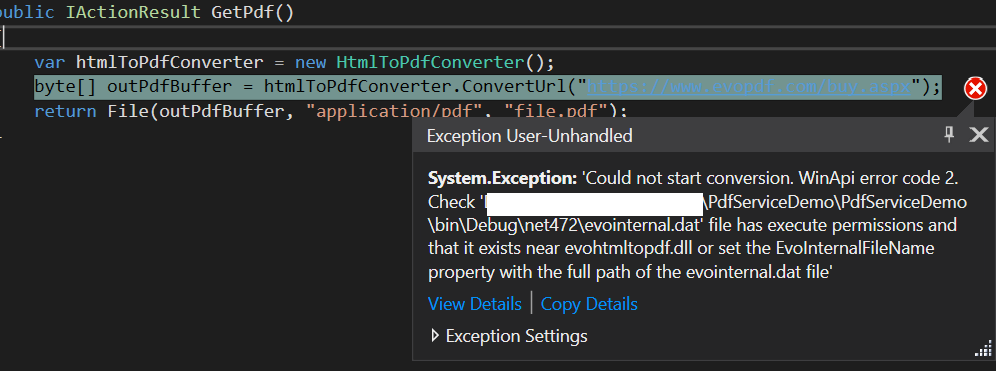

# pdfservicedemo

This is a sample application using [EvoPdf 7.5](https://www.evopdf.com/html-to-pdf-converter.aspx) that demonstrates an issue with the official nuget package.

## Expected behaviour

Calling the [webservice](https://localhost:44380/api/getpdf) should return a pdf file.

## Actual behaviour

HtmlToPdfConverter throws an exeption:

## Cause

The file evointernal.dat (contained in the NuGet package) does not get deployed to the \bin\Debug\net472 folder.

## Hotfix

Download the official NuGet package, unzip it and manually copy the file evointernal.dat to the \bin\debug\net472 folder.
